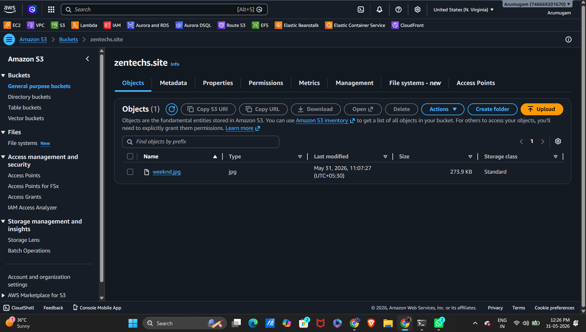

# CDN Setup
Objectives: 
* Host a static image in "S3" 
* deliver it globally through "Amazon CloudFront."

## Creating S3 Bucket
* using aws in mumbai region to create S3 bucket.
* I naming it zentechs.site
* uploaing some random image that i have downloaded.
----


## making object public
Making the bucket public temporarily. To Verify the image opens. Then create CloudFront.
* first, disable block public access and save it
* second, adding a buckect pocily
```
{
  "Version": "2012-10-17",
  "Statement": [
    {
      "Sid": "PublicRead",
      "Effect": "Allow",
      "Principal": "*",
      "Action": "s3:GetObject",
      "Resource": "arn:aws:s3:::zentechs.site/*"
    }
  ]
}
```
* after that copy the URL and check if it is working
---


## Creating CloudFront Distribution
* for Origin Domain: Selected my S3 bucket (zentechs.site)
* created a cloudfront distribution.
---


* checking with domain name if it is working.
---


## Now try with Portfolio 
* adding my portfolio html,css and js on S3 buckect
----
[ screenshot ]

* configure CloudFront "default root object"
```
Default Root Object
 index.html
```
* now checked with cnd domain if it worked
[screenshot of cdn-html]

______________________________________________________

### Hence, successfully built a real CDN-backed static website
