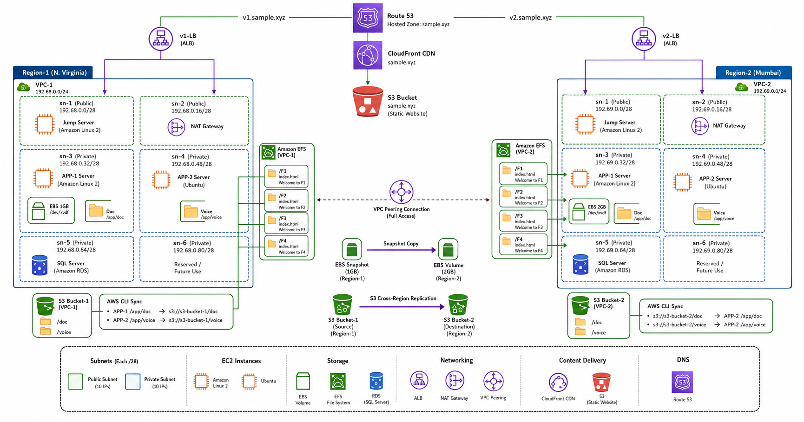

# AWS Multi-Region High Availability & Disaster Recovery Architecture
# Architecture Diagram


## Project Overview

This project demonstrates a complete Multi-Region AWS Infrastructure setup designed for:

- High Availability (HA)
- Disaster Recovery (DR)
- Cross-Region Replication
- Shared File Storage
- Global Content Delivery
- DNS-based Traffic Routing

The architecture is deployed across:

- Region-1 → North Virginia (VPC-1)
- Region-2 → Mumbai (VPC-2)

The project uses AWS Console for deployment and configuration.

---

# Architecture Components

## Networking

### VPC-1 (North Virginia)
CIDR: `192.168.0.0/24`

### VPC-2 (Mumbai)
CIDR: `192.69.0.0/24`

Each VPC contains:

| Subnet | Type | Purpose |
|---|---|---|
| sn-1 | Public | Jump Server |
| sn-2 | Public | NAT Gateway |
| sn-3 | Private | APP-1 Server |
| sn-4 | Private | APP-2 Server |
| sn-5 | Private | SQL Server |
| sn-6 | Private | Reserved |

---

# Services Used

- Amazon VPC
- EC2
- NAT Gateway
- Application Load Balancer (ALB)
- Amazon EBS
- Amazon EFS
- Amazon S3
- S3 Cross-Region Replication
- Amazon CloudFront
- Route 53
- VPC Peering
- AWS CLI
- RDS (SQL Server)

---

# Region-1 Configuration

## EC2 Instances

### APP-1
- OS: Amazon Linux 2023
- Mounted EFS Folder: F1
- EBS Volume: 1GB

### APP-2
- OS: Ubuntu
- Mounted EFS Folder: F2

### SQL Server
- Hosted in private subnet

---

# EBS Snapshot Migration

## Tasks Performed

- Created 1GB EBS volume
- Attached to APP-1
- Created sample data
- Generated snapshot
- Copied snapshot to Mumbai region
- Created new 2GB volume from snapshot
- Expanded filesystem without reboot

Verification commands:

```bash
lsblk
df -h
````

---

# Amazon EFS Configuration

Created shared EFS with folders:

* F1
* F2
* F3
* F4

Each folder contains unique `index.html` files.

Mount Targets:

| Folder | Mounted To     |
| ------ | -------------- |
| F1     | APP-1 Region-1 |
| F2     | APP-2 Region-1 |
| F3     | APP-1 Region-2 |
| F4     | APP-2 Region-2 |

---

# S3 Configuration

## Bucket-1 (Region-1)

Folders:

* doc
* voice

AWS CLI Sync:

```bash
aws s3 sync /app/doc s3://s3-bucket-1/doc
aws s3 sync /app/voice s3://s3-bucket-1/voice
```

---

## Bucket-2 (Region-2)

Configured:

* Cross-Region Replication from Bucket-1
* Automatic replication of:

  * doc
  * voice

Sync from S3 to EC2:

```bash
aws s3 sync s3://s3-bucket-2/doc /app/doc
aws s3 sync s3://s3-bucket-2/voice /app/voice
```

---

# Load Balancer Setup

## Region-1

* v1-LB
* Attached to public subnets:

  * sn-1
  * sn-2

## Region-2

* v2-LB
* Attached to public subnets:

  * sn-1
  * sn-2

---

# VPC Peering

Configured full-access VPC Peering between:

* VPC-1 (North Virginia)
* VPC-2 (Mumbai)

Updated:

* Route Tables
* Security Groups

---

# CloudFront + Route53

## Static Website Bucket

Bucket:

```text
sample.xyz
```

Configured:

* Static Website Hosting
* Sample image hosting
* CloudFront CDN integration

---

# DNS Routing

Hosted Zone:

```text
sample.xyz
```

Subdomains:

| Subdomain     | Target |
| ------------- | ------ |
| v1.sample.xyz | v1-LB  |
| v2.sample.xyz | v2-LB  |

---

# Project Workflow

1. User accesses domain
2. Route53 resolves DNS
3. CloudFront delivers cached content
4. ALB routes traffic to application servers
5. EFS provides shared storage
6. S3 handles backup and replication
7. Snapshot ensures disaster recovery

---
