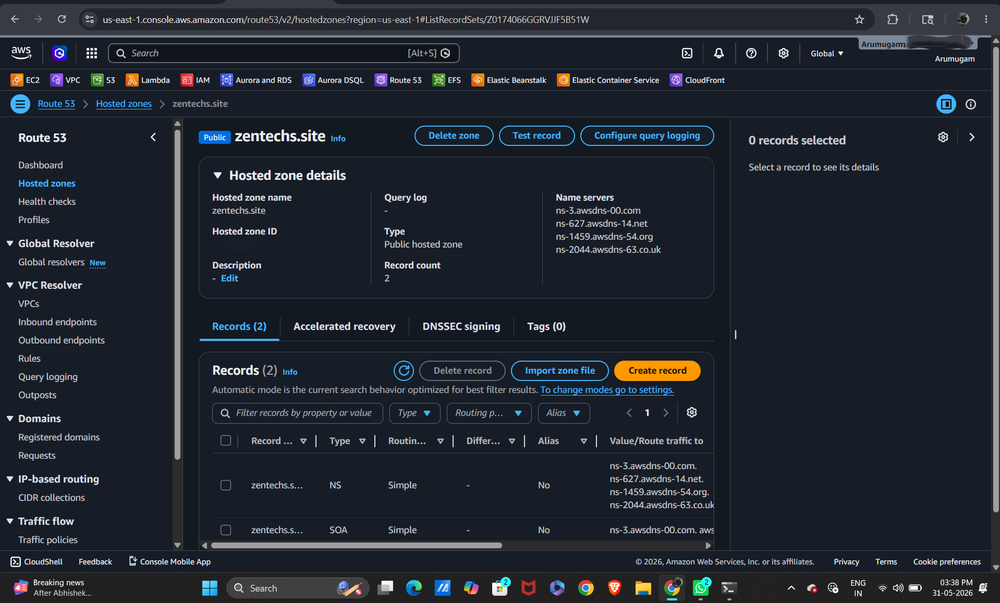
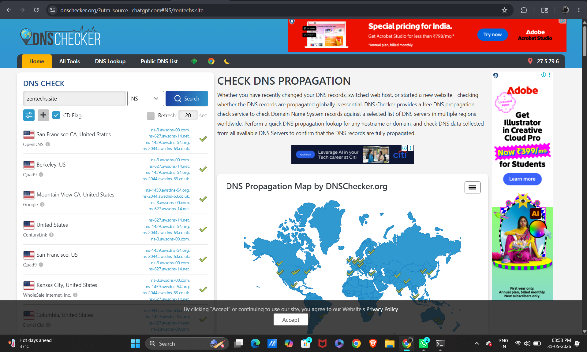

# Route 53
Objectives: 
* Connect my domain zentechs.site
* To both Load Balancers using Route 53.

## Creating Hosted Zone in Route53
* In, amazone route 53. created a hosted zone named "zentechs.site"
* Type: Public Hosted Zone
* After creation, route 53 generated 4 Name Servers (NS records)
---

## Updating Domain Nameservers
* I bought zentechs.site from Godaddy website.
* Replaced existing nameservers in Godaddy with the AWS Route 53 nameservers.
* saved it and verified it with DNS checker
* in DNS checker, typed zentechs.site on search bar and choosed NS record.
----

* also, verified Route 53 is active in terminal with command
```
nslookup -type=ns zentechs.site
```
---- 
[screenshot of terminal]

## Creating Record for v1-lb in route 53
* in Hosted Zones from Router 53. Clicked zentechs.site
* clicked on "create record"
* Record Name: v1
* Record Type: A
* enable the Alias
* Route Traffic To
```
Alias to Application and Classic Load Balancer
```
* Region
```
N. Virginia (us-east-1)
```
* Load Balancer(automatically show if you have it). select it.
* click create record
----------
What Actually Happened?

Route 53 created:
```
v1.zentechs.site
        │
        ▼
v1-lb-123456789.us-east-1.elb.amazonaws.com
```
* Users type: v1.zentechs.site
* Route 53 secretly redirects them to the ELB DNS.
* and load balancer distributes traffic between App-1 and App-2.

## Verifying DNS
* first through terminal
```
nslookup v1.zentechs.site
```
!verify DNS()
* Final Browser Test
```
http://v1.zentechs.site
```
!f1 verify()
!f2 verify()
